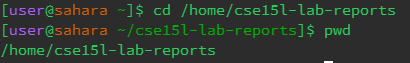
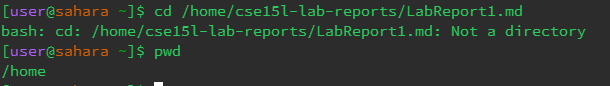
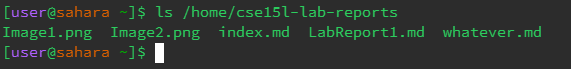
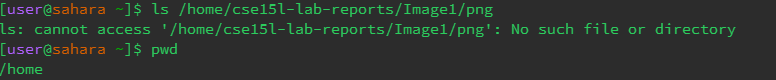
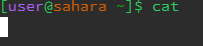
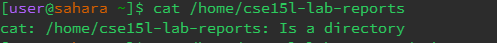
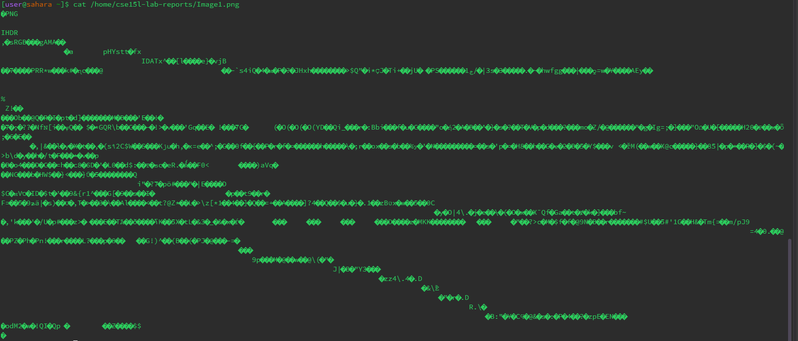

# **Lab Report 1**
## The Command *cd*: 

*No Arguments* : 

**Working Directory**: "/home"

**What is happening here?** When the command "cd" is run on a working directory that is not "/home", it sets the working directory to "/home". When the command is run without arguments on "/home", cd still sets the working directory to the home directory. 

**Possible error?** While not a massive error, it doesn't give the desired effect of changing the working directory to anything. 

---

*Path to a Directory* : 

**Working Directory**: "/home/cse15l-lab-reports"

**What is happening here?**  With a proper path, the command can change the directory to the "cse15l-lab-reports" path.

**Possible error?** No errors reported, all are working as intended. 

---

*Path to a File* : 

**Working Directory**: "/home"

**What is happening here?** Without a proper path or directory, it cannot change the working directory.

**Error** A definite error as setting the directory or the file path as an argument will produce an error as it is not a directory. 

## The Command *ls*:
*No Arguments*: 

**Working Directory**: "/home"

**What is happening here?** The command is producing a list of the files and folders in the home path, which in this case would only be "cse15l-lab-reports". 

**Possible error?** Works as intended. 

---

*Path to a Directory* : 

**Working Directory**: "/home"

**What is happening here?**  With a proper path, the command can can display the files and folders inside "cse15l-lab-reports".

**Possible error?** No errors reported, all are working as intended. 

---

*Path to a File* : 

**Working Directory**: "/home"

**What is happening here?** Without a proper path or directory, it cannot list out the files. There are no files or folders to list inside a file directory.

**Error** A definite error as setting the directory or the file path as an argument will produce an error as it is not a directory that can display the contents of files and folders inside it. 

## The Command *cat*:
*No Arguments*: 

**Working Directory**: "/home"

**What is happening here?** Without the proper path, entering "cat" does not print anything. It will instead leave a space that will repeat user input. 

**Possible error?** There are no errors as the command is waiting for user input. There will be a slot for input that will repeat any input typed into the terminal. 

---

*Path to a Directory* : 

**Working Directory**: "/home"

**What is happening here?**  With a directory as a path, the command is unable to print anything. 

**Possible error?** An error as "cat" will not be able to print anything, pointing out the argument was a directory, not a file path.  

---

*Path to a File* : 

**Working Directory**: "/home"

**What is happening here?** Without a proper path to a file path, it will be able to print the contents inside the file. In this case, it is printing many special characters that are unrecognizable because the file path was sent to a PNG file. 

**Possible error?** The command finally works as intended. 

