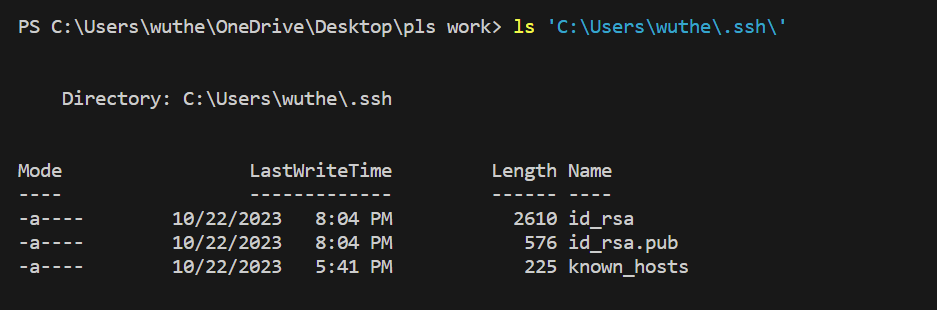
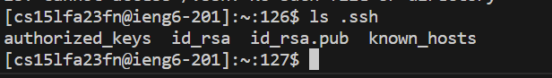

# **Lab Report 2** #
## Part 1 : 

```
import java.io.IOException;
import java.net.URI;
import java.util.ArrayList;

class Handler implements URLHandler {
    private ArrayList<String> lines = new ArrayList<>();
    private int sequence = 1; 

    public String handleRequest(URI url) {
        String query = url.getQuery();
        if (url.getPath().equals("/add-message")) {
            String[] parameters = url.getQuery().split("=");
            if (parameters[0].equals("s")) {
                String toAdd = parameters[1];
                lines.add(toAdd);
                sequence++;
                return responseWithNewLines();
            }
        }
            return "Please add parameters!\n";
    }
    private String responseWithNewLines() {
        StringBuilder response = new StringBuilder();
        for (int i = 0; i < lines.size(); i++) {
            response.append(lines.get(i)).append("\n");
        }
        return response.toString();
    }
}

class StringSearch {
    public static void main(String[] args) throws IOException {
        if(args.length == 0){
            System.out.println("Missing port number! Try any number between 1024 to 49151");
            return;
        }

        int port = Integer.parseInt(args[0]);
        Server.start(port, new Handler());
    }
}  
```


---

**Example:**


**Which methods in your code are called?** The code has a handleRequest method and the responseWithNewLines method. 

**What are the relevant arguments to those methods, and the values of any relevant fields of the class?** The relevant arguments for those methods require the parameter separated by "s=" in the URL. The relevant fields of the class include the sequence, the ArrayList, the query, the path, and the response. 

**How do the values of any relevant fields of the class change from this specific request? If no values got changed, explain why.** The sequence increments the number list by one for the next parameter. The parameter is added to the ArrayList. When starting, the number list starts off at 0 in the code and after updating the link with new words, it starts with the list off at 1 with the newly entered words. 


**Which methods in your code are called?** The code has a handleRequest method and the responseWithNewLines method. 

**What are the relevant arguments to those methods, and the values of any relevant fields of the class?** The relevant arguments for those methods require the parameter separated by "s=" in the URL. The relevant fields of the class include the sequence, the ArrayList, the query, the path, and the response. 

**How do the values of any relevant fields of the class change from this specific request? If no values got changed, explain why.** The sequence is incremented again for the next parameter. The parameter is also added to the ArrayList so that the next line is the correct number list and it prints the next parameter. The incrementation of the values would mean that 1 would become 2 as it continues the list with the newly entered words, following a numbered sequence of words every single time we hit the enter. 

## Part 2: 

**Private Key:** 

As shown, ls through my ssh folder directory shows the existence of my private key. 

---

**Public Key:** 

When logged in, I have the .ssh directory, and as shown here, there is the public key in my ieng6 account. 

---

**No Longer Need for My Password:** 

## Part 3:

While extremely finicky to set up, learning to set an SSH key for easy access to sign into my account on a local device without needing to type in the password. I also learned a bit more about how handle methods work and how they are set up as I was editing my Java code for it. 
