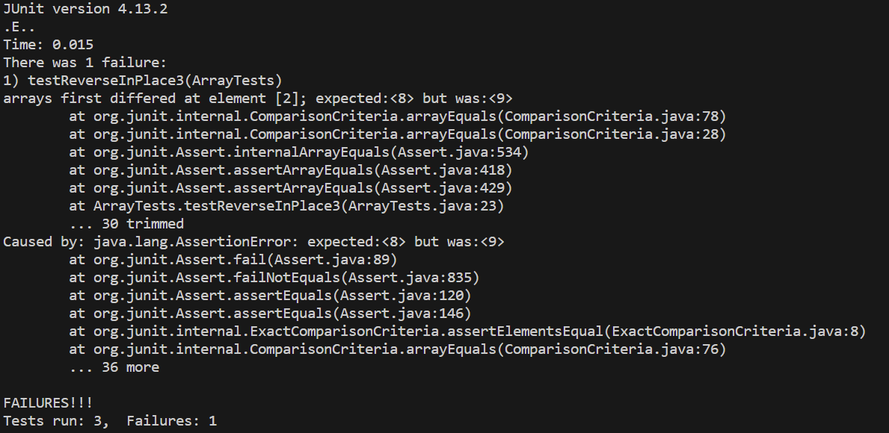
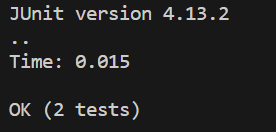

# **Lab Report 3** #
## Part 1 :
**Failure-Inducing Code:**
```
  @Test
  public void testReverseInPlace3() {
    int[] input1 = {7,8,9,10};
    ArrayExamples.reverseInPlace(input1);
    assertArrayEquals(new int[]{10,9,8,7}, input1);
  }
```
*Symptom:* 



**Code That's Not Inducing a Failure:**
```
  @Test
  public void testReverseInPlace() {
    int[] input1 = { 8 };
    ArrayExamples.reverseInPlace(input1);
    assertArrayEquals(new int[]{ 8 }, input1);
  }
```

*Symptom:*




Before the Code Fix:

```
  static void reverseInPlace(int[] arr) {
    for(int i = 0; i < arr.length; i += 1) {
      arr[i] = arr[arr.length - i - 1];
    }
  }
```

After Debugging: 

```
  static void reverseInPlace(int[] arr) {
    for(int i = 0; i < arr.length/2; i += 1) {
      int temp = arr[i]; //set the temporary value to i value's original number
      arr[i] = arr[arr.length - i - 1]; //that i value is moved backwards
      arr[arr.length - i - 1] = temp; //the replacing value's place is then swapped with the replacing value
    }
  }
```

*How did this work?*  

To properly create a for loop that would correctly reverse the contents inside our ArrayList, we would have to first create a for loop that would only go up to half of the total length. When we do reverse the values inside the ArrayList, we only need to reverse half of them as it effectively is just swapping opposing values so that it becomes reversed. The original code would essentially replace the values incorrectly. The fix provides a temporary variable that holds onto the original value while the index value gets replaced, so the replacing value is then swapped in for the temporary value. Consequently, this eventually outputs a reversed ArrayList of values.   

-----
## Part 2 :  **The command `grep`**


