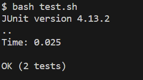

# **Lab Report 5** #
## Code Not Running?!?!? Tests Failing, not compiling either ## 

Student 1:
1 hour ago in General

I'm having issues running the test script. I don't know why I'm getting these test errors, but whatever change I make to the ListExamplesTest.java file isn't fixing anything. To run my files I bashed a test script file to compile all of the Java files with the jar file. Then I ran the tests through it by inputting the command while in the correct directory structure:

What am I missing? Right now, I'm stuck on how to fix these errors. Thank you.

---

TA (Staff):

Hi, rather than looking at just the ListExamplesTests.java file, as it is only testing whether your code works properly or not, maybe it is in one of your other Java files. There might be a bug in how you assign your variables that could be causing errors for your tests to fail. You also want to make sure that when you call the merge method, is it actually using the `add` function in the manner in which you want it to be? I would also double-check how your test script file is calling the JUnit tests. Additionally, in its current state, it won't produce the output you want (unless hint...you're on a Linux/Mac operating system).

---

Student 1:

OK thank you so much! I just realized I made a mistake on how the add method works.  Assigning a 0 first made any values added onto the ArrayList print out the list backward, not what I intended for it to do.  I also made two simple mistakes of not assigning the correct variables in their while loops, which was why my expected tests often did not match with what was being outputted. Finally, I also realized that the Junit tests weren't being called correctly because they needed to be a semi-colon (I'm on a Windows machine) and that the JUnit tests weren't being formatted correctly for it to be detected by Java. 

---

Step Four: 

The file & directory structure needed:

Contents of each file before fixing the bug:

Full Command Line You Ran to Trigger the Bug:

``bash test.sh`` 

---

## Part 2 -- Reflection

