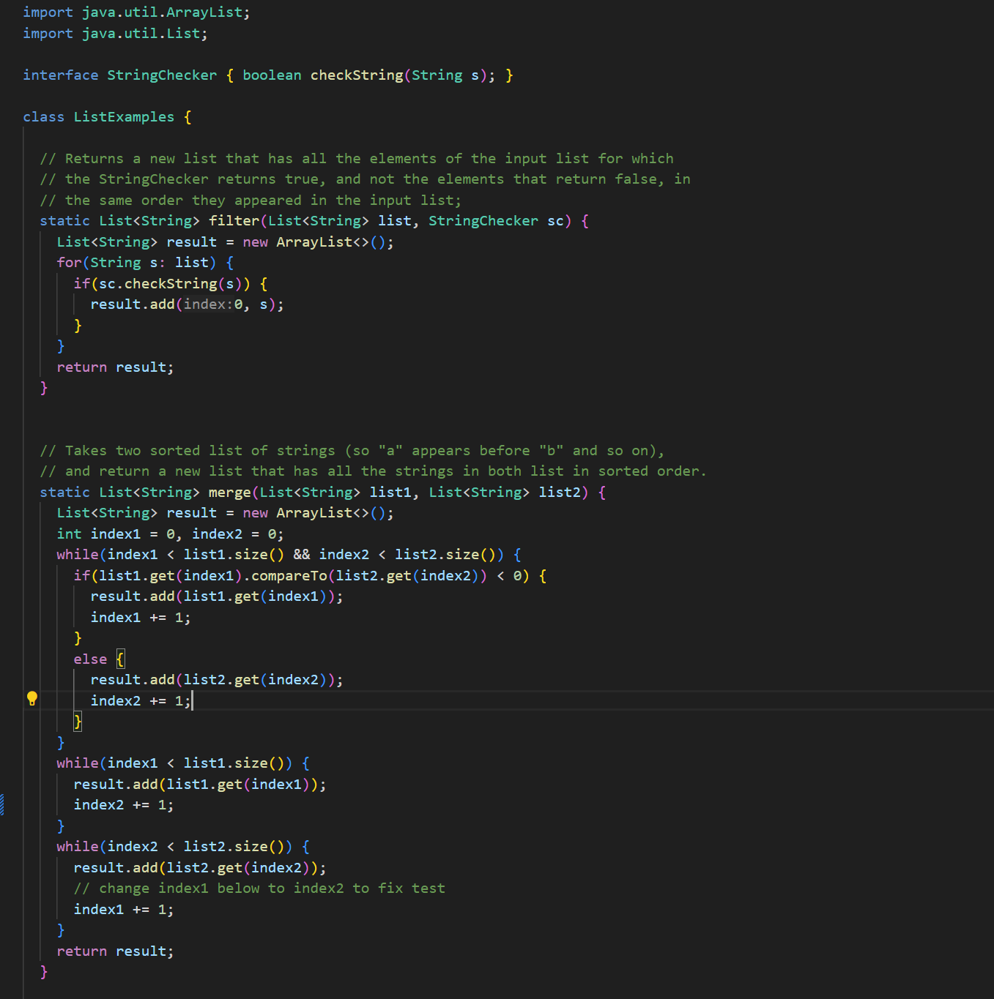
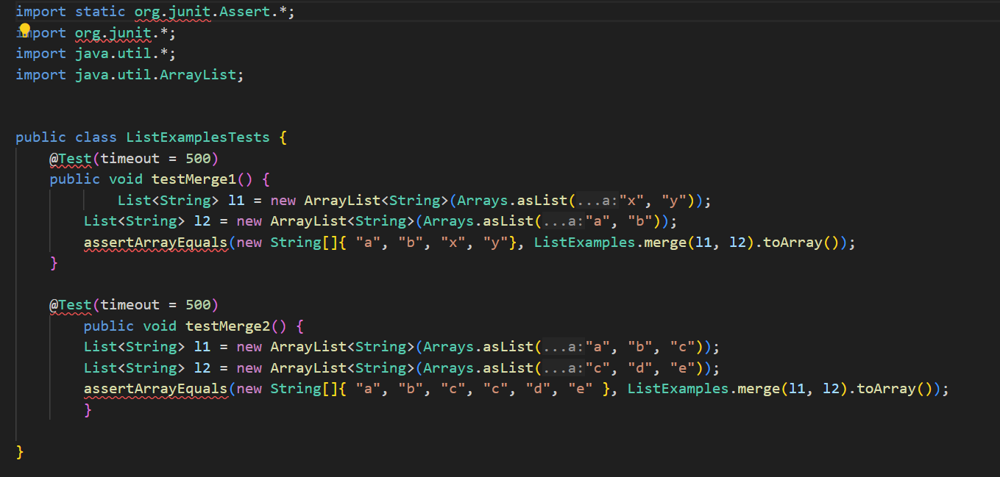
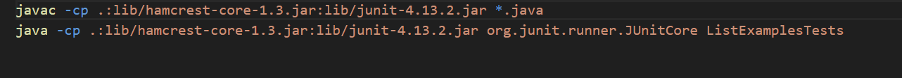
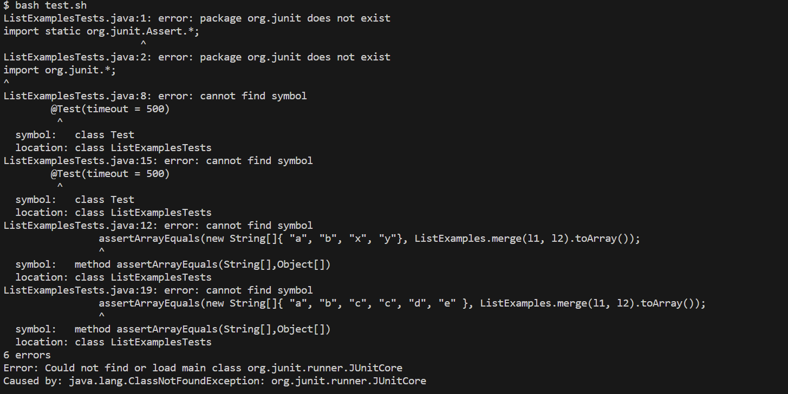
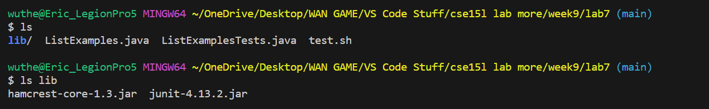

# **Lab Report 5** #
## Code Not Running?!?!? Tests Failing, not compiling either ## 

Student 1:
1 hour ago in General

These are my files:

I'm having issues running the test script. I don't know why I'm getting all of these test errors, but whatever change I make to the ListExamples.java file. 

In order to run my files I bashed a test script file in order to compile all of the Java files with the jar file. Then I ran the tests through it by inputting the command while in the correct directory structure:

``bash test.sh`` 

Below provided are all my files and directory structure. 

What am I missing? Right now, I'm stuck on how to fix these errors. Thank you.

---

TA (Staff):

Hi, rather than looking at just the ListExamplesTest.java file, as it is only testing whether your code works properly or not, maybe it is in one of your other Java file. There might be a bug in it that could be causing errors for your tests to fail. 

---

Student 1:

