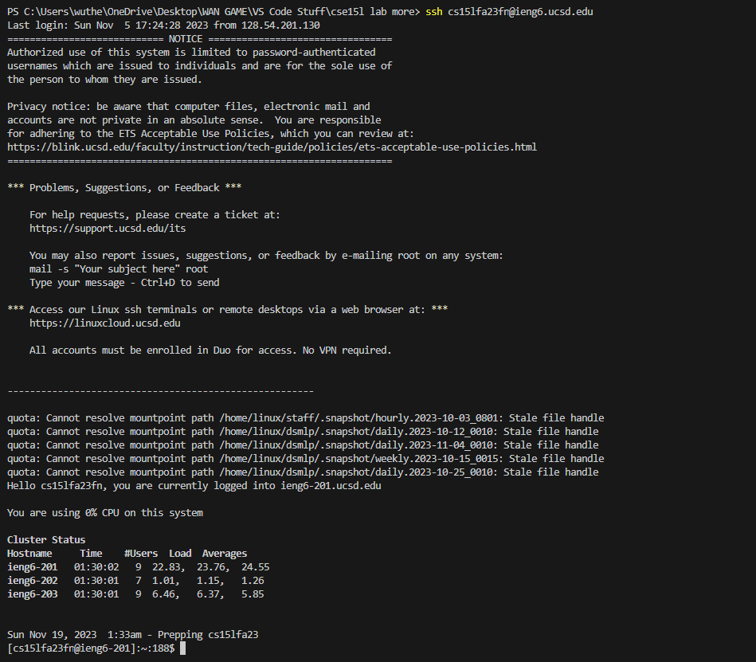
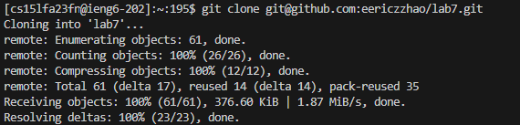
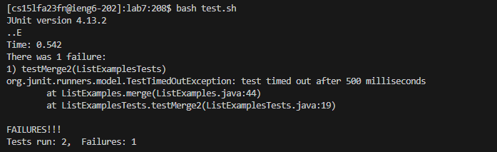
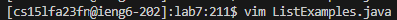
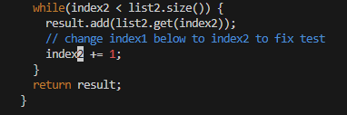
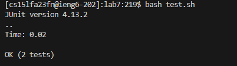
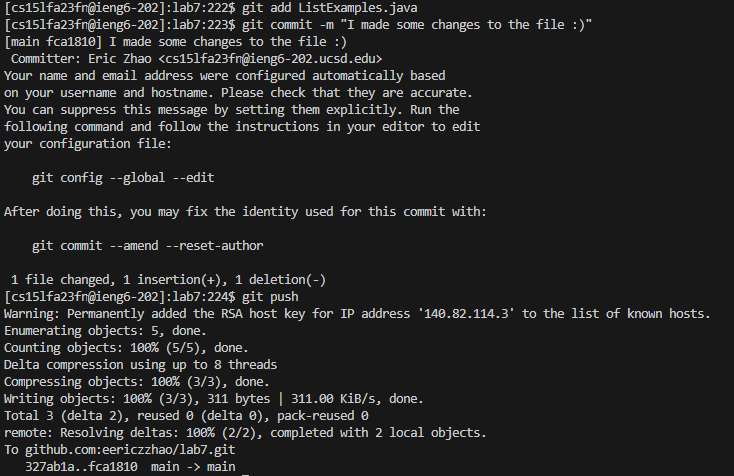

# **Lab Report Four**

Eric Zhao - Week 7 Lab Report

## Vim: Editing from the Command Line: 

1. Starting from the first step, I log in by typing in my ieng6 login:
   
   

   ```
   ssh cs15lfa23fn@ieng6.ucsd.edu <enter>
   ```
   *By signing in, I am prepping the necessary environment for me to start using Vim to edit my repository files through the terminal.*  
   
2. Next, I git cloned my fork of the `lab7` repository from my own GitHub account, using the SSH URL.

   

   ```
   git clone git@github.com:eericzzhao/lab7.git <enter>
   ```

   *While signed in, I git clone my forked repository. It clones that repository into my server account.* 
   
3. Logged in from my SSH account, I ran the `ListExamples.java` and `ListExamplesTests.java` files, demonstrating that they failed.

   

   ```
   cd lab7 <enter>
   
   bash test.sh <enter>
   ```
   *I change my working directory to the lab7 directory so that I have access to my files inside. I ran the test script that compiles both the Java files inside.* 
   
4. I then had to edit the `ListExamples.java` file through the Vim terminal in order to fix the failing test.

   

   ```
   vim ListExamples.java <enter>
   ```
   *This command allows me to enter Vim normal mode in the `ListExamples.java` file.*

   

   ```
   Keys Pressed: /index1 <enter>
   n n n n n n n n n, <right> <right> <right> <right> <right>
   x, i, 2
   :wq <enter>
   ```

   *In order to be able to quickly get to the line I needed, I indexed through the file by hitting the `/` command to get to the index1 that I needed to fix. After that, I hit `n` 9 times to get to the line that I            needed to fix. I hit my right arrow key 5 times to get to the letter that I was editing. I removed the "i" with the command `x` and inserted the two by hitting `i` and then typing "2" in. I then saved the changes         that I made to the file with the command `:wq`.*

6. I rerun the tests to make sure that they ran properly.

   

   ```
   bash test.sh <enter>
   ```

   *After saving my changes and rerunning the test script, the cases ran successfully after I was able to compile both Java files with no errors and pass both of the test cases.* 

8. Finally, I committed the changes and pushed the changed Java file onto my GitHub account

   

   ```
   git add ListExamples.java <enter>
   git commit -m "I made some changes to the file :)" <enter>
   git push <enter>
   ```

   *I added the file that I was going to push onto my GitHub account. I then made a commit with a message that provides context into what changes were made to the file or that changes were made. In the end, I pushed         the file onto my GitHub account by entering `git push` and the subsequent changes were visible in my GitHub account.* 

   
